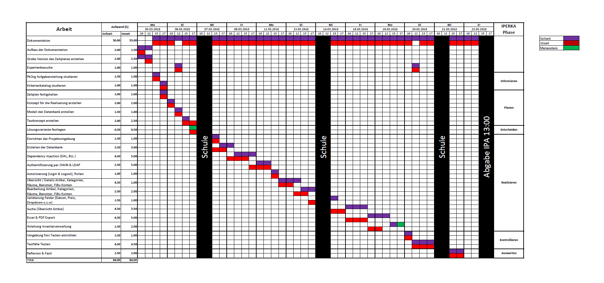

# IPA 2018 Informatiker EFZ Applikationsentwicklung /  Alpay Yildirim 🖥🔟🛠⚙️💡

## Kurzfassung 🏷
Meine individuelle praktische Arbeit (**IPA**) / **Informatiker EFZ Applikationsentwicklung** .  
**Note: 5.4** (Dokumentation, Zeitplan, Präsentation)  
**Ort: Schweiz 🇨🇭**, Kanton Aargau  
**Seitenanzahl Dokumentation : 134** Seiten  
**Sprache (Dokumentation / Zeitplan / Präsentation): Deutsch**  
**Projektmethode : IPERKA** -> (**I**nformieren,**P**lanen,**E**ntscheiden,**R**ealisieren,**K**ontrollieren,**A**uswerten)  
**Programmiersprache : C# / ASP.NET MVC**  
Webentwicklung (HTML / CSS / JavaScript)  

## Einleitung 📕

Dies ist meine individuelle praktische Arbeit (**IPA**), die ich 2018 in 10 Tagen geschrieben habe für den **Informatiker EFZ Fachrichtung Applikationsentwicklung**. Für die IPA habe ich eine Abschlussnote von **5.4** erhalten.  Ich fand es schade das im Internet nur sehr alte IPAs vor Jahrzehnten vorhanden waren, deswegen hatte ich mich entschlossen meine hochzuladen nach Abschluss der Lehre.  *Alle Firmenlogos/Namen etc. wurden selbstverständlich entfernt.*

## Inhalt 📚

- **Dokumentation** ([IPA-2018-Alpay-Yildirim-Muster.pdf](IPA-2018-Alpay-Yildirim-Muster.pdf)) 📘
- **Zeitplan** ([IPA-2018-Zeitplan.xlsx](IPA-2018-Zeitplan.xlsx) / [IPA-2018-Zeitplan.png](IPA-2018-Zeitplan.png) / [IPA-2018-Zeitplan.pdf](IPA-2018-Zeitplan.pdf)) 📗
- **Präsentation** ([IPA-2018-Präsentation.pdf](IPA-2018-Präsentation.pdf)) 📙

## Zeitplan 📗

- **IPERKA** -> (**I**nformieren,**P**lanen,**E**ntscheiden,**R**ealisieren,**K**ontrollieren,**A**uswerten) (Phasen rechts (➡️) angegeben)
- Istzeit (Rot) & Sollzeit (Violett) / Meilensteine (Grün)
- 2 Stunden Raster ( *1 Spalte = 2 Stunden (2h)* )

## Dokumentation 📘

### Inhaltsverzeichnis
- Vorwort ***5***
- Organisation der Arbeitsergebnisse ***6***
- Umfeld und Ablauf ***7***
  - Aufgabenstellung ***7***
    - Aufbau ***7***
    - Funktionen ***7***
  - Projektorganisation ***9***
  - Mittel und Methoden ***9***
  - Vorkenntnisse  ***9***
  - Vorarbeiten  ***10***
  - Arbeiten in den letzten 6 Monaten  ***10***
  - Hilfestellung  ***10***
  - Zeitplan  ***10***
  - Arbeitsjournal  ***12***
    - Montag, 5.03.2018 (Ganzer Tag) ***12***
    - Dienstag, 6.03.2018 (Ganzer Tag)  ***12***
    - Mittwoch, 7.03.2018 (Halber Tag)  ***13***
    - Freitag, 9.03.2018 (Ganzer Tag)  ***13***
    - Montag, 12.03.2018 (Ganzer Tag) ***13***
    - Dienstag, 13.03.2018 (Ganzer Tag)  ***14***
    - Mittwoch, 14.03.2018 (Halber Tag)  ***14***
    - Freitag, 16.03.2018 (Ganzer Tag)  ***15***
    - Montag, 19.03.2018 (Ganzer Tag) ***15***
    - Dienstag, 20.03.2018 (Ganzer Tag)  ***15***
    - Mittwoch, 21.03.2018 (Halber Tag)  ***16***
    - Freitag, 23.03.2018 (Halber Tag)  ***16***
  - Projekt  ***17***
    - Zusammenfassung (Kurzfassung)  ***17***
      - Ausgangslage (kurze Ausgangssituation)  ***17***
      - Umsetzung  ***17***
      - Ergebnis  ***17***
    - Einleitung  ***18***
    - Informieren  ***19***
      - Ziele der Aufgabenstellung  ***19***
      - Vorgaben  ***19***
      - Fragen  ***19***
    - Planen  ***20***
      - Realisierungskonzept  ***20***
      - Datenmodell  ***22***
      - Testkonzept  ***23***
      - Sitemap  ***33***
    - Entscheiden  ***34***
      - Varianten  ***34***
      - Entscheid  ***34***
    - Realisieren  ***35***
      - Projektumgebung  ***35***
      - Datenbank  ***36***
      - Entity Framework  ***36***
      - Partial Models  ***37***
      - Dependency Injection  ***39***
      - Authentifizierung & Autorisierung  ***42***
      - Layout  ***45***
      - Utilities  ***47***
      - Artikel  ***47***
      - AutoNumeric  ***49***
      - Suche  ***50***
      - PagedList  ***52***
      - Kategorien, Räume, Benutzer, FiBu Konten  ***53***
      - Validierung & Fehlermeldungen  ***53***
      - PDF Export  ***55***
      - Excel Export  ***56***
      - Anleitung  ***57***
      - Mehrsprachigkeit  ***57***
      - Design  ***57***
     - Kontrollieren  ***58***
       - Testprotokoll  ***58***
       - Testbericht ***59***
     - Reflexion  ***60***
     - Glossar  ***61***
     - Abbildungsverzeichnis  ***63***
     - Quellenverzeichnis  ***64***
     - Anhang ***65***
       - Anleitung  ***65***
       - MSSQL  ***73***
       - C#  ***74***
       - Views (cshtml)  ***109***
